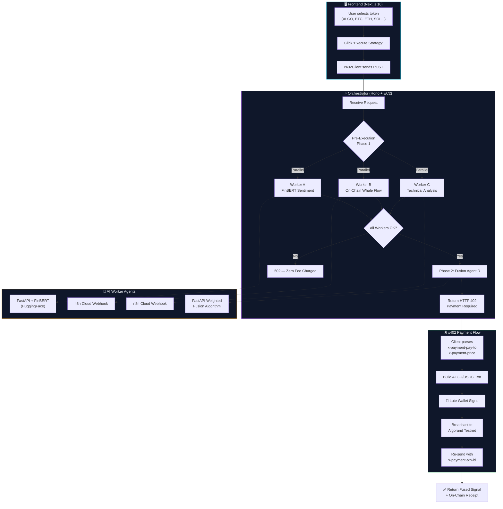

# QuantMesh x402

<div align="center">

### ⚡ Decentralized AI Micropayment Signal Router on Algorand

[](https://algorand.co)
[](https://www.x402.org/)
[](https://nextjs.org)
[](https://hono.dev)
[](https://n8n.io)
[](https://aws.amazon.com)
[](LICENSE)

**Pay $0.007 per AI-fused market signal — settled atomically on Algorand.**

[Live Demo](https://quantmesh.vercel.app) • [API Endpoint](https://api.dhanrajgupta.xyz/api/v1/orchestrate) • [Problem Statement PS0404](#problem-statement)

</div>

---

## 🧠 Problem Statement (PS0404 — AlgoVerse 2026)

> **Build an x402-powered pay-per-use DeFi intelligence product** that uses the HTTP 402 Payment Required protocol on the Algorand Virtual Machine (AVM) to gate access to AI-generated market signals behind atomic micropayments.

QuantMesh x402 solves this by orchestrating **4 specialized AI worker agents** (Sentiment, On-Chain Analytics, Technical Analysis, Fusion) behind a single HTTP gateway. Every API call triggers a **$0.007 micropayment** settled on Algorand Testnet — the user pays **only after** all agents succeed (zero-fee guarantee).

---

## 🏗️ Architecture



### Data Flow Summary

| Step | Component | Action |
|------|-----------|--------|
| 1 | **Frontend** | User selects token, clicks Execute Strategy |
| 2 | **x402Client** | Sends initial `POST /api/v1/orchestrate` |
| 3 | **Orchestrator** | Pre-executes Workers A, B, C in parallel |
| 4 | **Orchestrator** | Feeds scores to Fusion Agent D sequentially |
| 5 | **Orchestrator** | Returns `HTTP 402` with payment headers |
| 6 | **x402Client** | Builds ALGO/USDC transaction, prompts Lute Wallet |
| 7 | **Algorand Testnet** | Transaction confirmed on-chain (~2.8s) |
| 8 | **x402Client** | Re-sends request with `x-payment-txn-id` proof |
| 9 | **Orchestrator** | Validates payment, returns fused market signal |

---

## 🧩 Repository Structure

```
quantmesh-x402/
├── frontend/                    # Next.js 16 Dashboard & x402 Client
│   ├── src/app/page.tsx         # Terminal UI with signal radar
│   ├── src/app/providers.tsx    # Lute Wallet Provider (Algorand Testnet)
│   └── src/lib/x402Client.ts   # HTTP 402 challenge handler & transaction builder
├── orchestrator/                # Hono Router & x402 Payment Middleware
│   └── src/index.ts             # Pre-execution pipeline + CORS + 402 challenge
├── agent-sentiment-fusion/      # Python FastAPI (FinBERT + Fusion)
│   └── main.py                  # Worker A (Sentiment) + Worker D (Fusion)
├── agent-onchain-ta/            # Python FastAPI (On-Chain + TA)
├── workflows/                   # n8n Webhook Automation (Workers B & C)
├── deploy-ec2.sh                # Automated AWS EC2 deployment script
├── schema.json                  # Master API Contract (locked)
├── CHANGELOG_AI.md              # AI-generated audit log
└── README.md                    # You are here
```

---

## 🚀 Tech Stack

| Layer | Technology | Purpose |
|-------|-----------|---------|
| **Frontend** | Next.js 16 (App Router) | Reactive dashboard UI |
| **Wallet** | Lute Wallet + `@txnlab/use-wallet-react` | Algorand Testnet signing |
| **Orchestrator** | Hono.js + `@x402-avm/hono` | HTTP 402 payment middleware |
| **Payment** | x402 Protocol on Algorand AVM | $0.007 micropayment settlement |
| **Worker A** | Python FastAPI + FinBERT (HuggingFace) | NLP sentiment analysis |
| **Workers B/C** | n8n Cloud Webhooks | On-chain analytics & TA automation |
| **Worker D** | Python FastAPI | Weighted fusion scoring algorithm |
| **Blockchain** | Algorand Testnet (algosdk v3) | USDC ASA / native ALGO transfers |
| **Deployment** | AWS EC2 (t3.micro) + PM2 + Nginx + Certbot | Production HTTPS hosting |
| **SSL** | Let's Encrypt (Certbot) | `https://api.dhanrajgupta.xyz` |

---

## ⚙️ Local Development Setup

### Prerequisites
- Node.js 20+ & npm
- Python 3.10+
- [Lute Wallet](https://lute.app/) browser extension (Algorand Testnet)

### 1. Clone & Install

```bash
git clone https://github.com/dhanrajgupta2736/quantmesh-x402.git
cd quantmesh-x402

# Frontend
cd frontend && npm install && cd ..

# Orchestrator
cd orchestrator && npm install && cd ..

# Sentiment + Fusion Agent
cd agent-sentiment-fusion
pip install fastapi uvicorn httpx pydantic
cd ..
```

### 2. Configure Environment

```bash
cp orchestrator/.env.example orchestrator/.env
# Edit orchestrator/.env with your wallet address and worker URLs
```

### 3. Start Services

```bash
# Terminal 1: Orchestrator
cd orchestrator && npm run dev

# Terminal 2: Sentiment + Fusion Worker
cd agent-sentiment-fusion && uvicorn main:app --port 5001

# Terminal 3: Frontend
cd frontend && npm run dev
```

### 4. Open Dashboard
Navigate to [http://localhost:3000](http://localhost:3000), connect Lute Wallet, and click **Execute Strategy**.

---

## 📡 API Documentation

### `POST /api/v1/orchestrate`

**Request:**
```json
{
  "tokenSymbol": "ALGO"
}
```

**Response (after x402 payment):**
```json
{
  "status": "success",
  "groupTxId": "ALGORAND_TX_ID_HERE",
  "totalCostUsdc": "0.0070",
  "signalFusion": {
    "compositeScore": 72,
    "verdict": "STRONG BUY",
    "confidencePct": 88
  },
  "breakdown": {
    "sentimentScore": 78,
    "onChainWhaleFlow": "+18% Net Inflow",
    "technicalIndicator": "RSI 58 - Bullish Crossover"
  },
  "onChainReceipt": {
    "explorerUrl": "https://lora.algokit.io/testnet/transaction/...",
    "boxStorageHash": "a3f9b2c4e5f67890..."
  }
}
```

### `GET /api/v1/health`

Returns real-time health status of all worker agents.

```json
{
  "status": "healthy",
  "uptime": "2h 15m",
  "workers": {
    "sentiment": { "status": "online", "latencyMs": 120 },
    "onchain": { "status": "online", "latencyMs": 340 },
    "ta": { "status": "online", "latencyMs": 280 },
    "fusion": { "status": "online", "latencyMs": 95 }
  }
}
```

---

## 🔐 x402 Payment Protocol Flow

```
Client                          Orchestrator                    Algorand
  |                                  |                              |
  |  POST /orchestrate               |                              |
  |  (no payment header)             |                              |
  |--------------------------------->|                              |
  |                                  |  Pre-execute workers A,B,C   |
  |                                  |  Feed scores to Fusion D     |
  |  HTTP 402 Payment Required       |                              |
  |  x-payment-pay-to: HXT5Z6...    |                              |
  |  x-payment-price: 0.007         |                              |
  |<---------------------------------|                              |
  |                                  |                              |
  |  Build 0.007 ALGO/USDC Txn      |                              |
  |  Sign with Lute Wallet           |                              |
  |  Broadcast transaction           |                              |
  |------------------------------------------------------>         |
  |                                  |        Confirmed (~2.8s)     |
  |  POST /orchestrate               |                              |
  |  x-payment-txn-id: TX_ID        |                              |
  |--------------------------------->|                              |
  |                                  |  Verify payment              |
  |  200 OK — Fused Signal           |                              |
  |<---------------------------------|                              |
```

---

## 🌐 Live Deployment

| Service | URL |
|---------|-----|
| **API Gateway** | `https://api.dhanrajgupta.xyz/api/v1/orchestrate` |
| **Frontend** | `http://localhost:3000` (dev) |
| **n8n Workers** | `https://dhanrajgupta.app.n8n.cloud/webhook/agent-*` |
| **Block Explorer** | [AlgoKit Lora Testnet](https://lora.algokit.io/testnet) |

---

## 🏅 Key Features

- **Zero-Fee Guarantee:** If any worker agent fails pre-execution, no payment is charged
- **Dual Payment Support:** Seamless fallback between USDC ASA and native ALGO micropayments
- **1-Click ASA Opt-In:** Built-in USDC ASA 10458941 opt-in flow directly in the UI
- **Real AI Models:** FinBERT (HuggingFace) for production-grade NLP sentiment scoring
- **Multi-Token Support:** ALGO, BTC, ETH, SOL, AVAX, PEPE, LINK, DOGE, SUI
- **On-Chain Verification:** Every payment verifiable on Algorand block explorer
- **Pre-Execution Architecture:** Workers execute before payment, ensuring value delivery

---

## 👥 Team

| Role | Stack |
|------|-------|
| Frontend & x402 Client | Next.js, Lute Wallet, algosdk |
| Orchestrator & Deployment | Hono.js, AWS EC2, PM2, Nginx |
| AI Workers | Python FastAPI, FinBERT, n8n Cloud |
| Blockchain | Algorand Testnet, USDC ASA, x402-AVM |

---

## 📝 License

MIT License — Built for [AlgoVerse 2026 Hackathon](https://algoverse.dev) (PS0404)
