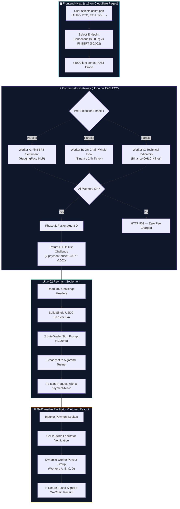

# QuantMesh x402

<div align="center">

### ⚡ Decentralized AI Micropayment Signal Router on Algorand

[](https://algorand.co)
[](https://www.x402.org/)
[](https://qm.dhanrajgupta.xyz)
[](https://nextjs.org)
[](https://hono.dev)
[](https://aws.amazon.com)
[](LICENSE)

**Pay $0.007 for Multi-Agent Consensus or $0.002 for Standalone FinBERT Sentiment — Settled Atomically on Algorand.**

[🌐 Production Terminal](https://qm.dhanrajgupta.xyz) • [⚡ Production API](https://api.dhanrajgupta.xyz/api/v1/orchestrate) • [📖 Problem Statement PS0404](#-problem-statement-ps0404--algoverse-2026)

</div>

---

## 🧠 Problem Statement (PS0404 — AlgoVerse 2026)

> **Build an x402-powered pay-per-use DeFi intelligence product** that uses the HTTP 402 Payment Required protocol on the Algorand Virtual Machine (AVM) to gate access to AI-generated market signals behind atomic micropayments.

QuantMesh x402 orchestrates **4 specialized AI worker agents** (Sentiment, On-Chain Analytics, Technical Analysis, Fusion) behind a single HTTP gateway. It exposes two distinct pay-per-use x402 endpoints:

1. **4-Agent Consensus ($0.007 USDC / 7,000 µUSDC)** — Full multi-agent signal fusion with dynamic on-chain payouts across 4 worker wallets.
2. **FinBERT Sentiment ($0.002 USDC / 2,000 µUSDC)** — Single-agent HuggingFace FinBERT Financial NLP sentiment analysis with a 15-second scoped pre-execution cache.

Every request adheres to a **Zero-Fee Guarantee** — if any worker agent fails pre-execution, HTTP 502 returns and $0 is charged.

---

## 🌐 Live Production Deployment

| Layer | Service | Host / Target URL | Status |
|---|---|---|---|
| **Frontend UI** | Cloudflare Pages (Midnight Aurora Terminal) | [https://qm.dhanrajgupta.xyz](https://qm.dhanrajgupta.xyz) | 🟢 Live |
| **API Gateway** | AWS EC2 (Hono + Certbot SSL) | `https://api.dhanrajgupta.xyz/api/v1/orchestrate` | 🟢 Live |
| **Sentiment Endpoint** | AWS EC2 (Single-Agent $0.002) | `https://api.dhanrajgupta.xyz/api/v1/sentiment-only` | 🟢 Live |
| **Market Data API** | Binance Public 24h Ticker & OHLC | `https://api.binance.com/api/v3/ticker/24hr` | 🟢 Live |
| **Facilitator** | GoPlausible x402 Verification | `https://facilitator.goplausible.xyz` | 🟢 Verified |
| **Block Explorer** | AlgoKit Lora Testnet | [Lora Testnet Explorer](https://lora.algokit.io/testnet) | 🟢 Active |

---

## 🎨 Midnight Aurora UI & Trading Dashboard Architecture

The frontend is built with Next.js 16 (Static Export) featuring the **Midnight Aurora** design system:

- **Trading Data Stream Ticker**: Real-time scrolling ticker bar displaying 24h market prices and percentage changes across 8 top crypto pairs.
- **Hero 3-Column Layout**:
  - **Left**: Interactive Score Gauge with vibrant color thresholds (Emerald for Bullish, Amber Gold `#F59E0B` for Neutral, Rose for Bearish) and SSR-deterministic tick rendering.
  - **Center**: Asset selector pills (9 markets), Multi-Agent Agreement Conviction Bar, 4-Stage Protocol Stepper (`HTTP 402 Probe` → `Wallet Signature` → `Block Settlement` → `Receipt Verified`), and Primary Execute CTA.
  - **Right**: **Sub-Agent Swarm Radar** — All 4 worker agents (Workers A, B, C, D) run simultaneous SVG processing ring animations during strategy execution.
- **Dual Theme System**: Seamless toggle between **Cyber Dark** mode (`#0A0E1A` background with electric violet & cyan glow accents) and **Sleek Light** mode (`#F9FAFB` background).
- **Verifiable Receipt & Dynamic Split Bar**: Displays client payment TxID, GoPlausible verification status, worker payout group TxID, cryptographic attestation hash, and direct links to the Lora Block Explorer.

---

## 💰 Performance-Weighted AI Tokenomics

QuantMesh implements **Performance-Weighted AI Tokenomics**. Sub-agents that provide higher signal quality and confidence are automatically rewarded on-chain with a larger share of the micropayment pool.

### 1. 4-Agent Consensus Payout Split ($0.0070 USDC / 7,000 µUSDC)

- **Total Client Payment**: `7,000 µUSDC` ($0.0070)
- **Dynamic Worker Payout Calculation**:
  $$\text{Payout}_A = \left( \frac{\text{Weight}_{\text{Sentiment}}}{\text{Weight}_{\text{Sentiment}} + \text{Weight}_{\text{Whales}}} \right) \times 4,000\text{ }\mu\text{USDC}$$
  $$\text{Payout}_B = 4,000\text{ }\mu\text{USDC} - \text{Payout}_A$$
- **Worker C (Technicals)**: `1,000 µUSDC` ($0.0010)
- **Worker D (Consensus Engine)**: `1,000 µUSDC` ($0.0010)
- 👑 **QuantMesh Gateway Router Profit**: **`1,000 µUSDC` ($0.0010 = 14.3% Margin)** retained in router wallet (`4DTSNS...`).

### 2. FinBERT Sentiment Single-Agent Split ($0.0020 USDC / 2,000 µUSDC)

- **Total Client Payment**: `2,000 µUSDC` ($0.0020)
- **Worker A (FinBERT Sentiment)**: `1,750 µUSDC` ($0.00175 = 87.5%)
- 👑 **QuantMesh Gateway Router Profit**: **`250 µUSDC` ($0.00025 = 12.5% Margin)**

---

## 🏗️ System Architecture



---

## 📡 API Documentation & Endpoints

### 1. `POST /api/v1/orchestrate` — 4-Agent Consensus ($0.007 USDC)

**Request:**
```json
{
  "tokenSymbol": "ALGO"
}
```

**Response (after x402 payment):**
```json
{
  "status": "success",
  "clientPaymentTxId": "WWQ5JWRONELKASQCNNYVRJ24NFJMJNHB2BOJ5MKQGNZJVLELNLSQ",
  "workerPayoutGroupTxId": "7TRNNPJSFBC54W...",
  "totalCostUsdc": "0.0070",
  "dynamicSplit": {
    "amountA": 2062,
    "amountB": 1938,
    "amountC": 1000,
    "amountD": 1000,
    "weights": { "sentiment": 0.5155, "onchain": 0.4845 }
  },
  "signalFusion": {
    "compositeScore": 51,
    "verdict": "NEUTRAL",
    "confidencePct": 75
  },
  "breakdown": {
    "sentimentScore": 66,
    "onChainWhaleFlow": "-0.1% Net Outflow",
    "technicalIndicator": "RSI 35.2 - Bearish Pressure | MACD Bearish"
  },
  "onChainReceipt": {
    "explorerUrl": "https://lora.algokit.io/testnet/transaction/WWQ5JWR...",
    "facilitatorVerification": { "isValid": true }
  }
}
```

### 2. `POST /api/v1/sentiment-only` — FinBERT Sentiment ($0.002 USDC)

Includes a 15-second scoped `workerACache` to prevent redundant sub-agent execution between the HTTP 402 probe and retry requests.

**Request:**
```json
{
  "tokenSymbol": "ALGO"
}
```

**Response (after x402 payment):**
```json
{
  "status": "success",
  "endpoint": "sentiment-only",
  "clientPaymentTxId": "H3AKML6FFP...",
  "totalCostUsdc": "0.0020",
  "sentiment": {
    "score": 66,
    "source": "HuggingFace FinBERT Serverless Router",
    "sentimentVerdict": "BULLISH"
  },
  "onChainReceipt": {
    "explorerUrl": "https://lora.algokit.io/testnet/transaction/H3AKML...",
    "facilitatorVerification": { "isValid": true }
  }
}
```

### 3. `GET /api/v1/health`

Returns real-time latency and health status of all sub-agent workers:

```json
{
  "status": "healthy",
  "uptime": "46h 12m",
  "workers": {
    "sentiment": { "status": "online", "latencyMs": 34 },
    "onchain": { "status": "online", "latencyMs": 17 },
    "ta": { "status": "online", "latencyMs": 17 },
    "fusion": { "status": "online", "latencyMs": 18 }
  }
}
```

---

## 🧩 Repository Structure

```
quantmesh-x402/
├── frontend/                    # Next.js 16 Dashboard & x402 Client
│   ├── src/app/globals.css      # Midnight Aurora Design System v3 & Animations
│   ├── src/app/page.tsx         # Trading Dashboard with 4-Agent Swarm Radar & Score Gauge
│   ├── src/app/architecture/    # System architecture & protocol explainer page
│   ├── src/lib/x402Client.ts    # Dual x402 probe, Lute Wallet signer & retry handler
│   └── next.config.ts           # Cloudflare Pages static export configuration
├── orchestrator/                # Hono Gateway Router & x402 Middleware
│   ├── src/index.ts             # Pre-execution pipeline, CORS & workerACache
│   ├── src/endpoint.config.ts   # Network CAIP-2, ASA IDs & wallet config
│   ├── src/atomicBuilder.ts     # Dynamic 4-worker atomic group builder
│   └── src/facilitatorClient.ts # GoPlausible Facilitator API client
├── agent-sentiment-fusion/      # Python FastAPI (Worker A FinBERT + Worker D Fusion)
│   └── main.py                  # HuggingFace FinBERT NLP & weighted fusion engine
├── agent-onchain-ta/            # Python FastAPI (Worker B Whale Flow + Worker C Technicals)
│   └── main.py                  # Binance Public Market & Hourly Klines OHLC engine
├── deploy-ec2.sh                # Automated EC2 deployment script with Certbot SSL
├── CHANGELOG_AI.md              # Mandatory AI change audit log
└── README.md                    # You are here
```

---

## ⚙️ Local Development Setup

### Prerequisites
- Node.js 20+ & npm
- Python 3.10+
- [Lute Wallet](https://lute.app/) extension (Algorand Testnet)

### 1. Clone & Install Dependencies

```bash
git clone https://github.com/dhanrajgupta2736/quantmesh-x402.git
cd quantmesh-x402

# Install Frontend
cd frontend && npm install && cd ..

# Install Orchestrator
cd orchestrator && npm install && cd ..
```

### 2. Start Local Services

```bash
# Terminal 1: Orchestrator Gateway (Port 4000)
cd orchestrator && npm run dev

# Terminal 2: Sentiment + Fusion Worker (Port 5001)
cd agent-sentiment-fusion && python main.py

# Terminal 3: On-Chain + TA Worker (Port 5002)
cd agent-onchain-ta && python main.py

# Terminal 4: Frontend App (Port 3000)
cd frontend && npm run dev
```

Navigate to [http://localhost:3000](http://localhost:3000) to view the terminal locally.

---

## 🏅 Key Hackathon Differentiators

- **Midnight Aurora Trading UI**: High-contrast dark/light theme, live data stream ticker, precomputed SSR-deterministic score gauge, and simultaneous 4-agent swarm ring animations.
- **Zero-Fee Guarantee**: Pre-execution verifies sub-agent availability before signature prompt. If any worker fails, HTTP 502 returns and $0 is charged.
- **Dual x402 Endpoints**: 4-Agent Consensus ($0.007) and FinBERT Sentiment ($0.002) demonstrate price-tiered micropayment signal routing.
- **15-Second Scoped Worker Cache**: Prevents duplicate FinBERT inference calls during probe/retry HTTP 402 challenges.
- **Instant Lute Wallet Popup (<100ms)**: Single-transaction client payment eliminates Lute code 4300 group errors.
- **Performance-Weighted AI Tokenomics**: Sub-agents earn dynamic payouts ($W_s, W_o$) based on signal contribution clarity.
- **Binance Live Market Feed**: 100% real-time unthrottled market data across 9 assets.
- **GoPlausible Facilitator Verified**: Fully compliant with third-party x402 verification and settlement logging.

---

## 📝 License

MIT License — Built for [AlgoVerse 2026 Hackathon](https://algoverse.dev) (PS0404 Track).
