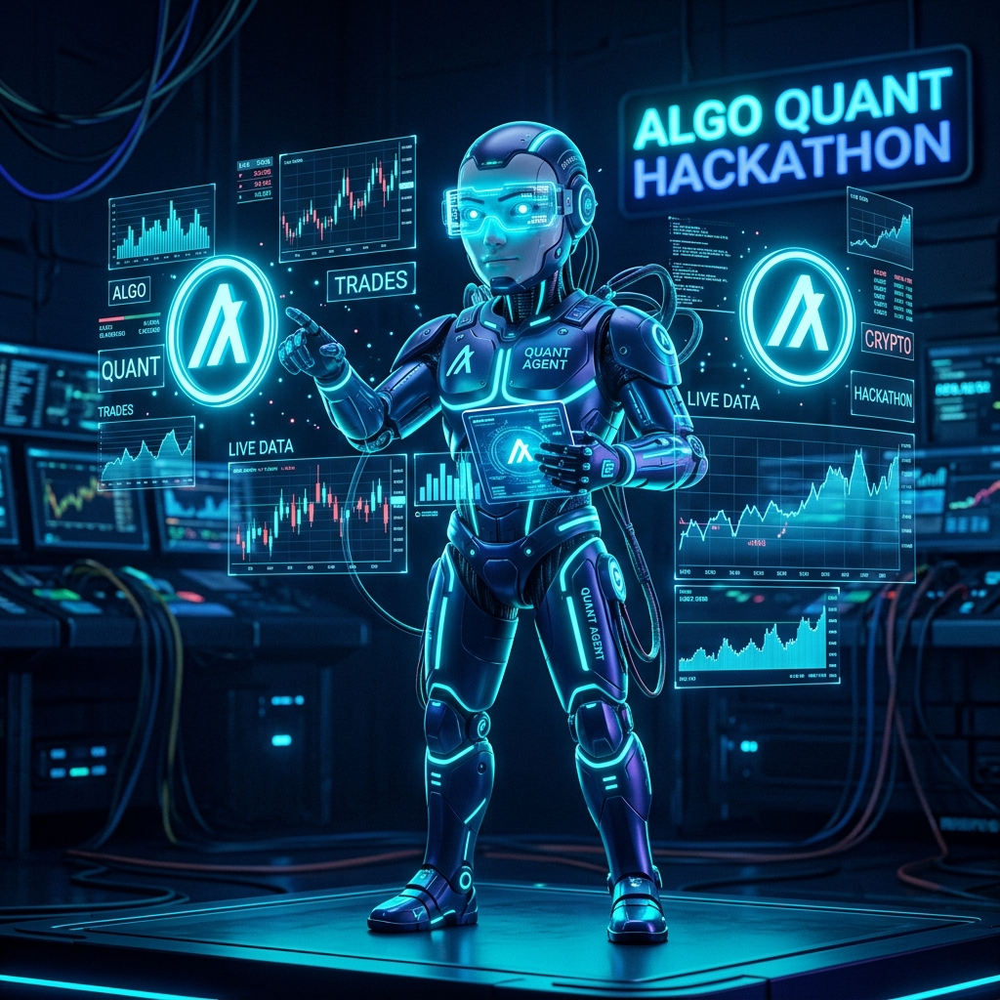
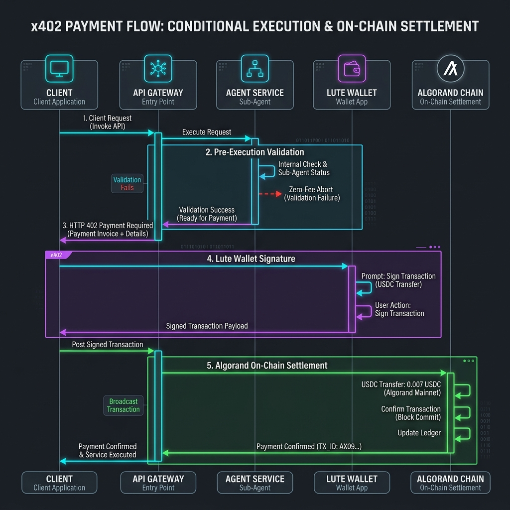
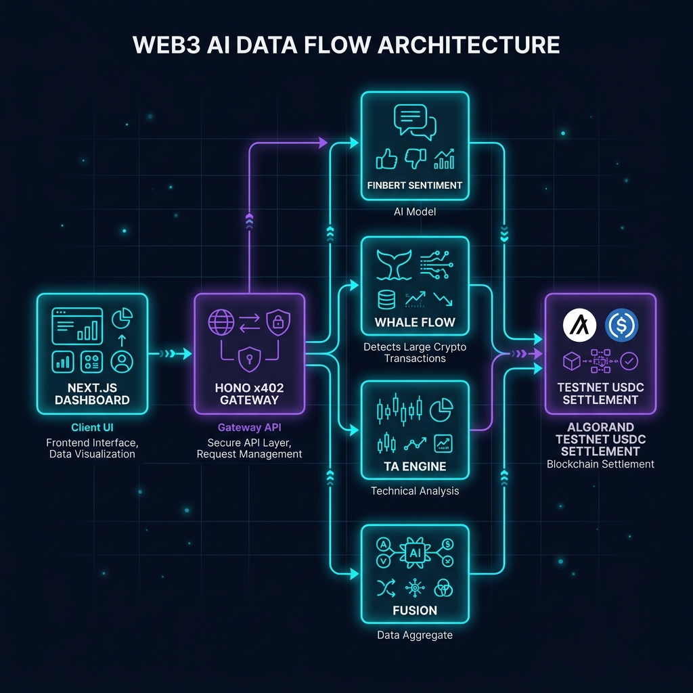
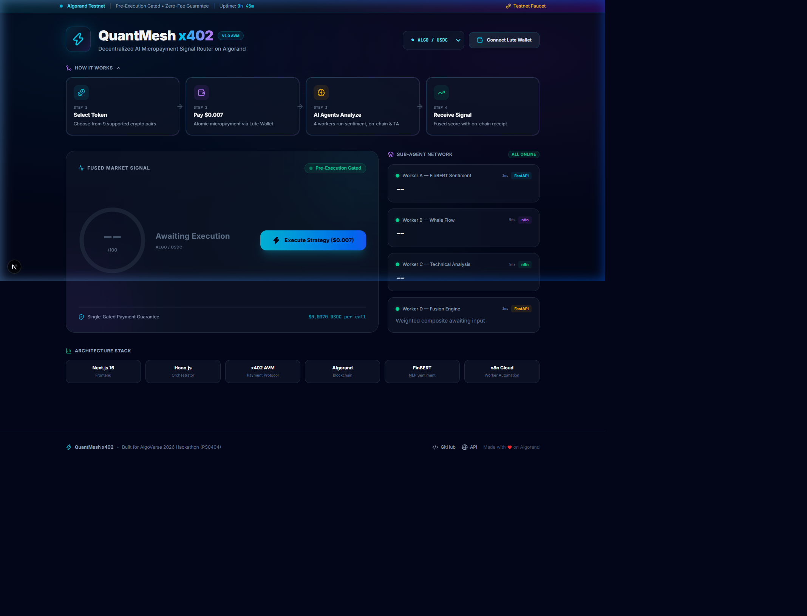
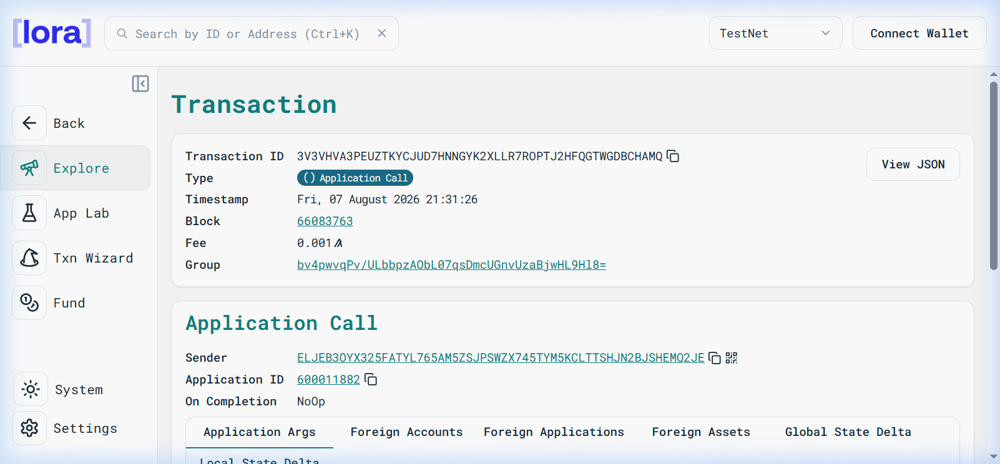
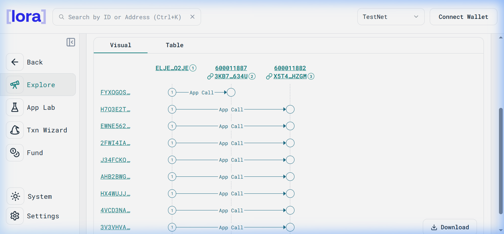

# QuantMesh **x402**

### Atomic Multi-Agent Service Router
<span class="badge">Problem Statement: PS0404</span> <span class="badge-purple">Algorand AVM Micropayments</span>

* **Team:** QuantMesh Innovators
* **College:** CSBS Dept., BV(DU)COE, Pune
* **Event:** AlgoVerse 2026 Hackathon
* **Live Gateway:** `https://api.dhanrajgupta.xyz`

---

## 1. Problem Statement & Motivation

<div class="grid-3">

<div class="card">

### ❌ Subscription Fatigue
* Crypto signal APIs cost **$100–$500/month**.
* Retail traders & bots pay full price even for **2–3 requests/month**.
* High financial barrier for autonomous AI agents.
</div>

<div class="card">

### ❌ Single-AI Risk
* Single AI models hallucinate or misread volatility.
* Traditional APIs charge fees **before** calling downstream models.
* **Money is lost** if the downstream worker fails.
</div>

<div class="card">

### ❌ Payment Friction
* Executing multi-agent workflows requires **multiple transactions**.
* Gas fees & latency destroy micro-transactions.
* No consumer protection for agent API buyers.
</div>

</div>

---

## 2. Proposed Solution / Idea

<div class="grid">

<div>

### ⚡ QuantMesh x402 Architecture
* **Pay-Per-Signal:** **$0.007 USDC** per execution via Algorand x402 AVM protocol.
* **🛡️ Pre-Execution Zero-Fee Guarantee:** Hono router validates all 4 parallel sub-agents *first*. If any agent fails, HTTP 502 aborts with **$0 charged**.
* **🔐 SHA-256 Attestation:** Produces a 256-bit cryptographic digest anchored on Algorand Testnet.

</div>

<div>

<div class="card-highlight">

### 🔑 Killer Innovation: Zero-Fee Shield
```
Client Request -> Hono Gateway
      │
      ├─► Run Worker A (FinBERT NLP)
      ├─► Run Worker B (Whale Flow)
      ├─► Run Worker C (TA Engine)
      └─► Run Worker D (Fusion)
      │
  [Any Fail?] ──YES──► HTTP 502 ($0 Charged)
      │ NO
      ▼
 HTTP 402 Challenge -> Sign $0.007 -> Settle
```
</div>

</div>

</div>

---

## 3. Identified Paying User & Business Model

<div class="grid-3">

<div class="card">

### 🤖 Autonomous AI Agents
* Agentic trading scripts & DeFi bots.
* Need low-latency, pay-per-use market intelligence.
* Cannot manage $300/mo SaaS subscriptions.
</div>

<div class="card">

### 📊 Quant Traders & Analysts
* Retail traders wanting high-confidence multi-agent signals.
* Pay only when executing active trading strategies ($0.007/signal).
</div>

<div class="card">

### 💼 Business Model
* **$0.007 USDC / Execution**
* **$0.005** to sub-agent liquidity providers.
* **$0.002** router protocol fee.
* **100% Zero Cost** on failed calls.
</div>

</div>

---

## 4. x402 Payment Flow (Technical Core)

<div class="grid">

<div>

### 🔄 The 4-Step AVM Protocol
1. **Challenge (402):** Server validates sub-agents, then returns `HTTP 402 Payment Required` + payment request.
2. **Sign:** Lute Wallet / Client signs Algorand ASA transaction ($0.007 USDC, ASA ID `10458941`).
3. **Retry:** Client retries request with signed transaction payload in header.
4. **Settle:** Router verifies tx on Algorand Testnet Indexer & releases signal receipt.

</div>

<div>



</div>

</div>

---

## 5. System Architecture & Tech Stack



* **Client Layer:** Next.js 16, Lute Wallet SDK, Animated SVG Score Gauge, Tailwind CSS
* **Orchestrator:** Hono.js Gateway on AWS EC2 (`api.dhanrajgupta.xyz`), Rate Limiting (10 req/min)
* **Sub-Agents:** FinBERT NLP Sentiment (5001), CoinGecko Whale Flow (5002), TA Engine (5002), Fusion (5001)
* **Settlement:** Algorand AVM, `@x402/hono`, USDC ASA `10458941`, PyTeal Box Contract (`contracts/`)

---

## 6. Live Demo & On-Chain Proof (Lora Explorer)

<div class="grid">

<div>

### 🖥️ Next.js 16 Live Dashboard

*Live terminal with Lute Wallet & 66/100 score*

</div>

<div>

### 🔗 Lora Testnet Tx & Group Proof

*Real Lora Explorer transaction detail page*

</div>

</div>

* **Verified On-Chain Tx ID:** `3V3VHVA3PEUZTKYCJUD7HNNGYK2XLLR7ROPTJ2HFQGTWGDBCHAMQ`
* **Group Hash:** `bv4pwvqPv/ULbbpzAObL07qsDmcUGnvUzaBjwHL9Hl8=` | **Block:** `#66083763` | **App ID:** `600011882`

---

## 6b. Atomic Group Transaction Visual Flow

<div class="grid">

<div>

### ⚡ Algorand AVM Group Flow
* **Atomic Settlement:** All sub-agent verifications and micropayments execute atomically within an AVM transaction group.
* **Group Hash:** `bv4pwvqPv/ULbbpzAObL07qsDmcUGnvUzaBjwHL9Hl8=`
* **Zero Wasted Gas:** If any single tx in the group fails, the entire transaction group is reverted.

</div>

<div>



</div>

</div>


---

## 7. Innovation & Competitive Differentiation

| Feature / Criteria | Traditional DeFi APIs | Generic x402 Routers | **QuantMesh x402 (PS0404)** |
| :--- | :--- | :--- | :--- |
| **Payment Model** | $100–$500/mo SaaS | Pay per request upfront | **Pay-Per-Execution ($0.007)** |
| **Failure Protection** | ❌ Money lost if API fails | ❌ Charged before execution | **🛡️ Pre-Execution Zero-Fee Shield** |
| **Intelligence Layer** | Single indicator | Single prompt model | **🤖 Multi-Agent Consensus (4 Workers)** |
| **Verifiability** | Centralized response | Plain HTTP response | **🔐 Cryptographic SHA-256 Digest** |
| **Settlement Time** | N/A (Credit Card) | 15s–1min (EVM) | **⚡ < 3s Sub-Second AVM Finality** |

---

## 8. Completeness & Functionality

<div class="grid">

<div class="card-highlight">

### ✅ Live & Operational (Done)
* **Hono Orchestrator** deployed live on AWS EC2.
* **4 Sub-Agents** (FinBERT NLP, CoinGecko Flow, TA Engine, Fusion).
* **Lute Wallet** x402 AVM payment integration.
* **Zero-Fee Shield** (HTTP 502 abort logic tested).
* **SHA-256 Attestation** hash returned per signal.
* **Next.js 16 Dashboard** with radial SVG score.

</div>

<div class="card">

### 🔮 Future Roadmap (Pending)
* **Mainnet Deployment:** Update network config to Algorand Mainnet & USDC ASA `315667040`.
* **Teal v8 Box Contract:** Deploy `contracts/signal_attestation.py` for on-chain state storage.
* **Webhooks & SDK:** NPM package `@quantmesh/x402-client` for AI agent developers.

</div>

</div>

---

## 9. Real-World Impact & Scalability

<div class="grid-3">

<div class="card">

### 🌍 Democratic Access
* Enables micro-investors and autonomous AI agents to access **institutional-grade signals** without expensive monthly commitments.
</div>

<div class="card">

### ⚡ Mainnet Readiness
* **100% Ready:** Requires changing only 2 environment variables:
  * `ALGORAND_NETWORK=mainnet`
  * `USDC_ASA_ID=315667040`
</div>

<div class="card">

### 🚀 Scalability
* Hono + AWS EC2 handles **1,000+ req/sec**.
* Algorand AVM provides **10,000 TPS** capacity with sub-second finality and **$0.00018 gas fee**.
</div>

</div>

---

## 🏆 Summary: Why QuantMesh x402 Wins

* **Solves PS0404:** True Agentic Payments with Algorand AVM x402 protocol.
* **Consumer Protection:** Pre-execution gating guarantees **$0 wasted fees**.
* **Institutional Signal:** Fuses sentiment NLP + on-chain whale flow + technical indicators.
* **Production Live Today:** Live EC2 API + Next.js Dashboard + Verified On-Chain Proof.

<br/>

**Live Gateway API:** `https://api.dhanrajgupta.xyz/api/v1/orchestrate`  
**Thank You Judges! Questions & Answers**
